# Anthem

## Website Analysis

+ **Let's run nmap and check what ports are open**
  ```
  nmap -sC -sV -oN nmap/initial 10.10.130.57

  Description
  -sV			Attempts to determine the version of the services running
  -sC			Scan with the default nmap scripts
  -oN			Save the output file to the directory listed
  ```
+ **Result**
  ```
  Host is up (0.42s latency).
  Not shown: 995 closed ports

  PORT     STATE SERVICE       VERSION
  80/tcp   open  http          Microsoft HTTPAPI httpd 2.0 (SSDP/UPnP)
  135/tcp  open  msrpc         Microsoft Windows RPC
  139/tcp  open  netbios-ssn   Microsoft Windows netbios-ssn
  445/tcp  open  microsoft-ds?
  3389/tcp open  ms-wbt-server Microsoft Terminal Services
  | rdp-ntlm-info: 
  |   Target_Name: WIN-LU09299160F
  |   NetBIOS_Domain_Name: WIN-LU09299160F
  |   NetBIOS_Computer_Name: WIN-LU09299160F
  |   DNS_Domain_Name: WIN-LU09299160F
  |   DNS_Computer_Name: WIN-LU09299160F
  |   Product_Version: 10.0.17763
  |_  System_Time: 2020-05-18T07:07:27+00:00
  | ssl-cert: Subject: commonName=WIN-LU09299160F
  | Not valid before: 2020-04-04T22:56:38
  |_Not valid after:  2020-10-04T22:56:38
  |_ssl-date: 2020-05-18T07:08:36+00:00; 0s from scanner time.
  Service Info: OS: Windows; CPE: cpe:/o:microsoft:windows

  Host script results:
  | smb2-security-mode: 
  |   2.02: 
  |_    Message signing enabled but not required
  | smb2-time: 
  |   date: 2020-05-18T07:07:26
  |_  start_date: N/A
  ```
+ **What port is for the web server?**

  ```
  80/tcp   open  http          Microsoft HTTPAPI httpd 2.0 (SSDP/UPnP)
  ```
  We can see the web server is running on **port 80** based on the result.
  
+ **What port is for remote desktop service?**
  ```
  3389/tcp open  ms-wbt-server Microsoft Terminal Services
  ```
  We can see the RDP service is running on **port 3389** based on the result.
  
+ **What is a possible password in one of the pages web crawlers check for?**
  
  We can check the robots.txt file on the web server.
  
  <p align="center">
  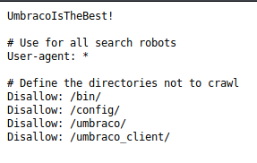
  </p>
  
  we got the "possible password" on the robots file, which is **UmbracoIsTheBest!**.

+ **What CMS is the website using?**
  
  <p align="center">
  
  </p>
 
  We can check the robots.txt file and we can see there's a directory called **/umbraco/** on the Disallow part, so this web server use umbraco CMS.

+ **What is the domain of the website?**
  
  <p align="center">
  
  </p>
  
  As we can see on the homepage, the server use **anthem.com** as the domain.

+ **What's the name of the Administrator**

  First, we must check all the pages that exist on the server.  There is an articled called "A cheers to our IT department". There is a poem on the content that belongs to him (the Admin). 
  
  <p align="center">
  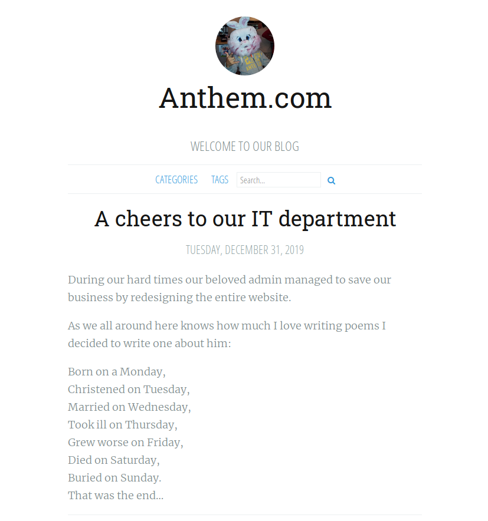
  </p>
  
  Let's search it up on the search engine should we?
  
  <p align="center">
  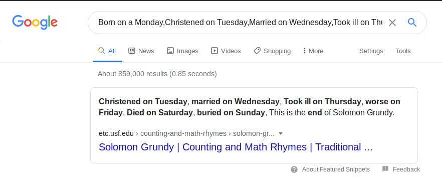
  </p>
  
  And.. We got the Administrator name! (the poem autor), which is **Solomon Grundy**.
 
+ **Can we find find the email address of the administrator?**

  There is an article called "We are hiring" and the appliers must send the CV to JD@anthem.com. 

  <p align="center">
  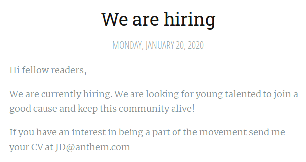
  </p>
  
  Change the "JD" letter to "SG" (Solomon Grundy) and we got the Admin e-mail! It's **SG@anthem.com**.
  <br>
  
## Spot The Flags

+ **What is flag 1?**

  We should check the source-code of each page before going to anything else. On the ["We are hiring" article](http://10.10.130.57/archive/we-are-hiring/), we can find the flag at the meta content from the source-code. It's **THM{L0L_WH0_US3S_M3T4}**.
  
  <p align="center">
  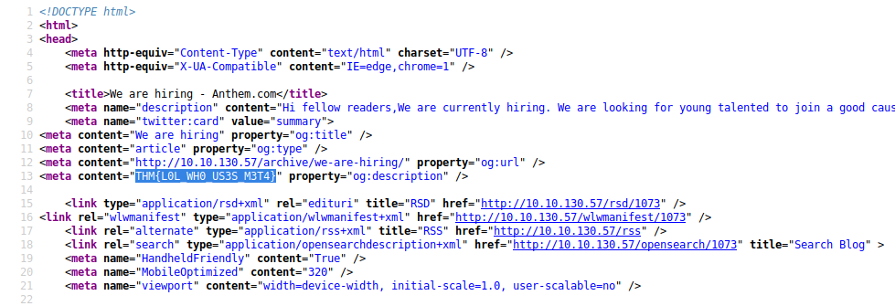
  </p>
  
+ **What is flag 2?**

  We also find the flag on the "Search" menu's source-code! It's **THM{G!T_G00D}**.
  
  <p align="center">
  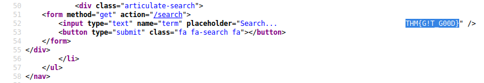
  </p>
  
+ **What is flag 3?**

  We can find the flag on the "Author" menu's source-code that we can find on the bottom page on the article! It's **THM{L0L_WH0_D15}**.
  
  <p align="center">
  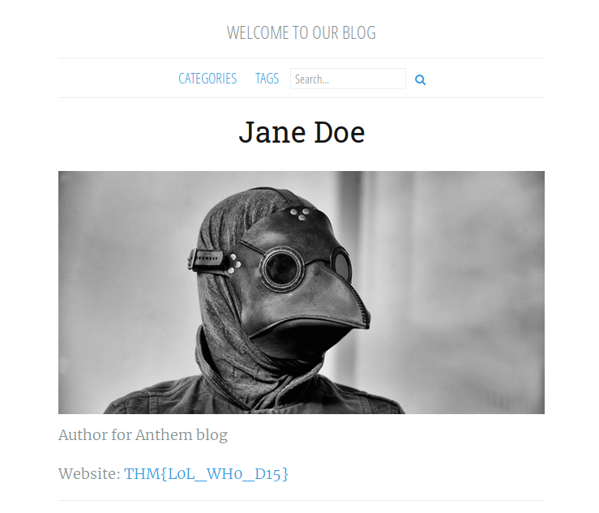
  </p>
  
+ **What is flag 4?**

  We can find the flag on the ["A cheers to our IT deparment" article](http://10.10.130.57/archive/a-cheers-to-our-it-department/) article's source-code! It's **THM{AN0TH3R_M3TA}**.
  
  <p align="center">
  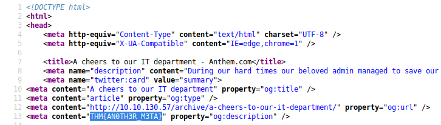
  </p>
  <br>
  
## Final Stage

+ **Let's figure out the username and password to log in to the box.(The box is not on a domain)**

  We already have the username and the peassword from the previous task.
  
  ```
  username: SG
  password: UmbracoIsTheBest!
  ```
  
+ **Gain initial access to the machine, what is the contents of user.txt?**

  Now we connect to the RDP to **10.10.183.65:3389** by using the credential above.
  
  <p align="center">
  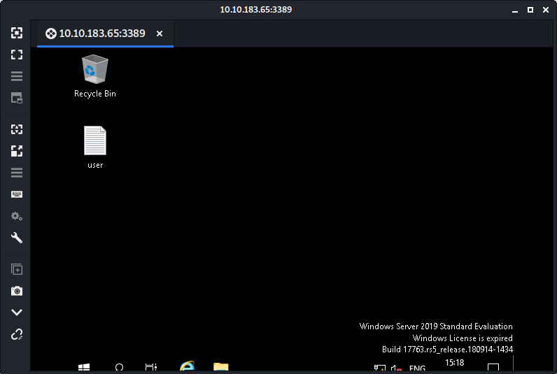
  </p>
  
  Boom! We got connected to the RDP. Now we open the **user.txt** file and see the content. 
  
  <p align="center">
  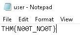
  </p>
  
  We got the flag! **THM{N00T_NO0T}**.
  
+ **Can we spot the admin password?**

  First, we must enable the "View hidden file" option first. Then we search some directory to find the "Hidden file" that contain the admin password. There's a hidden directory called "backup"!.
  
  <p align="center">
  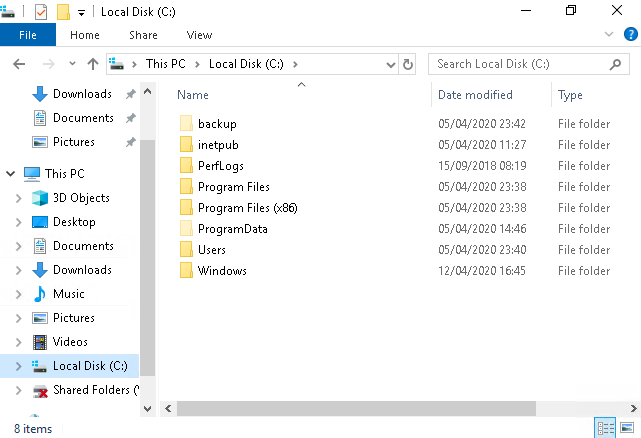
  </p>
  
  Go into that dir and open the "restore.txt" file! but we can't because of the permissions.
  
  <p align="center">
  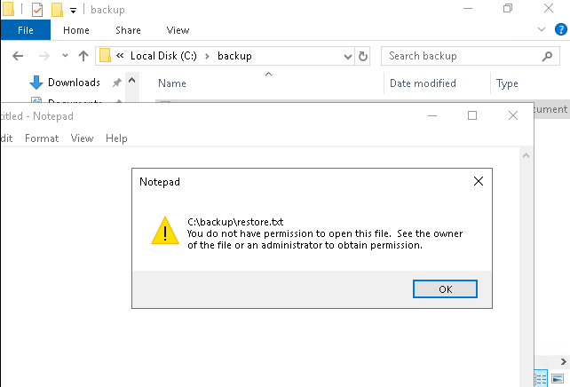
  </p>
  
  We can open that file by changing the permissions because we got permissions to change everything (we're the owner of that file).
  
  <p align="center">
  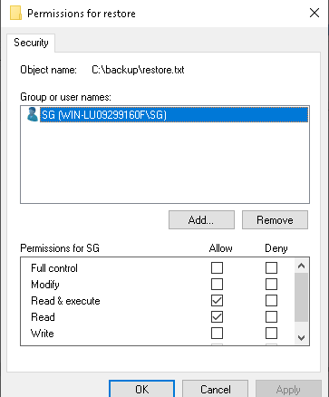
  </p>
  
  Now we try to open the "restore.txt" file again! And... We got the admin password!. It's **ChangeMeBaby1MoreTime**
  
  <p align="center">
  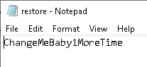
  </p>
  
+ **Escalate your privileges to root, what is the contents of root.txt?**

  Since we already have the admin password, we go to the Admin directory in the C:\Users\Administrator. And then we go to his Desktop and open the "root.txt" file. Boom! We got the admin's flag! **THM{Y0U_4R3_1337}**.
  
  <p align="center">
  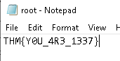
  </p>
  
  
